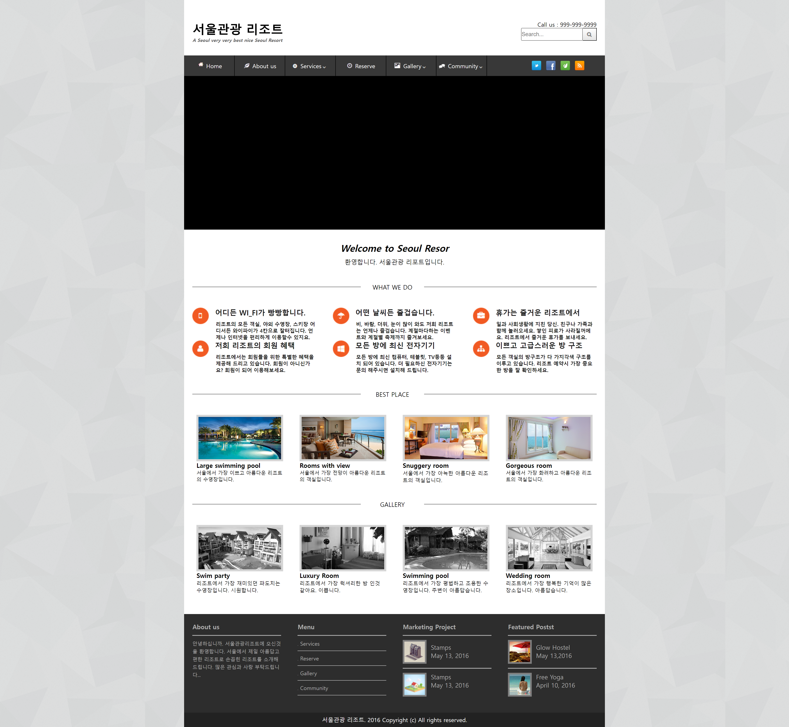

# **🖥️ 안녕하세요! 저를 소개합니다!**

## 📜 목차
1. 👨🏻‍💻 [간단 소개](#1-간단-소개)
2. 🏆 [수상 경력](#2-수상-경력)
3. ⏰ [프로젝트 소개](#프로젝트-소개)
    - 고등학교 웹디자인 및 개발 부문 지방대회 및 전국대회 과제
    - 대학교 웹 어플리케이션 과목 기말과제
    - 디자인 도안을 받고 제작한 외주 작업
    - 개인 공부 목적으로 만들어본 클론 메인페이지 코딩
---

### 1. 간단 소개

> 안녕하세요! ***"항상 새로운 도전을 좋아하는"*** 박태영입니다.
> 고등학교에 다닐 때부터 웹 개발을 시작하여 꾸준히 도전하며 ***"어떠한 환경에서도 적응"*** 할 수 있습니다.   

- 프론트엔드 기술 역량 : HTML5, CSS3, Javascript(ES6), jQuery
- 백엔드 기술 역량 : JSP. PHP
- 데이터베이스 기술 역량 : MYSQL

---

### 2. 수상 경력

1. 2017 지방기능경기대회
    - *수여 기관 : 광주광역시 기능경기위원회*
    - *수여내용 : 2017 지방기능경기대회 웹디자인 및 개발 직종 우수상*
2. 2015 지방기능경기대회
    - *수여 기관 : 광주광역시 기능경기위원회*
    - *수여내용 : 2015 지방기능경기대회 웹디자인 및 개발 직종 동메달*

---

### 3. 프로젝트 소개

#### 고등학교 지방대회 및 전국대회 과제

- 고등학교 기능반 당시 출전했던 지방대회, 전국대회 지역별 문제들을 연습 하면서 공부했던 기록입니다.

  - 전국대회 전남지역 문제풀이

  - 전국대회 경기지역 문제풀이

  - 전국대회 서울지역 문제풀이

  - 지방대회 서울지역 문제풀이

* 대회문제는 1~4과제로 이루어져 있었고 1과제: 포토샵, 일러스트 디자인 / 2과제: HTML5,CSS3 퍼블리싱 / 3과제:  Javascript, jQuery 기능 구현 / 4과제: mysql, php 백엔드 영역 문제 풀이로 이루어져 있었습니다.
